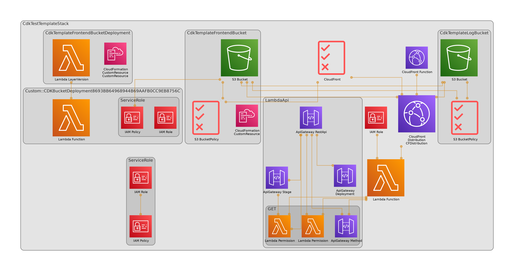

## 構成図(cdk-dia で自動作成)



### 構成図自動作成

```
npx cdk-dia --collapse=false

# 簡易版
npx cdk-dia

※WSL上にgraphvizが必要
sudo apt install graphviz
```

## 環境

- node 20.9.0
- npm 10.1.0
- Nextjs 14.2.5
- CDK 2.148.0

## 初期構築時にやったこと

### プロジェクト作成

1.cdk プロジェクト作成

```
cdk init app --language typescript
```

2.フロントアプリ作成

```
npx create-next-app@latest frontend
```

### フロント構築

3.フロントアプリに移動

```
cd frontend
```

4.[next.config.mjs](frontend/next.config.mjs)に以下を追記

```
output: "export"
```

5.ビルド

```
npm run build
```

6.サーバー立ち上げ

```
npm run dev
```

7.画面確認（http://localhost:3000）

### AWS 環境構築

8.cdk コード追記

9.ターミナルで aws にログイン

10.デプロイ

```
cdk deploy --profile ${ログインしたユーザー}
```

11.cloudfront の URL で画面確認

## 構築手順

1.プロジェクトクローン

```
git clone https://gitlab-system-dev.k-idea.jp/sys-dev/ai_system/development_9/takada/cdk-test-template.git
```

2.プロジェクト移動

```
cd cdk-test-template
```

3.npm インストール

```
npm i
```

4.フロントアプリへ移動

```
cd frontend
```

5.npm インストール

```
npm i
```

6.ビルド

```
npm run build
```

7.ルートへ移動

```
cd ../
```

8.ターミナルで aws にログイン

9.デプロイ

```
cdk deploy --profile ${ログインしたユーザー}
```

## ローカル環境立ち上げ

1.フロントアプリへ移動

```
cd frontend
```

2.npm インストール

```
npm i
```

3.サーバー立ち上げ

```
npm run dev
```

## AWS 環境削除時

1. AWS コンソールから cloudfront のログバケット(cdkTemplateLogBucket)を空にする

- ACL を有効にしているもしくは、cloudfront からログを出力し続けてるせいで destroy 時にバケットを空にできなさそう
- いいアイデアが浮かばないので手動削除

2. 環境削除

- ```
  cdk destroy --profile ${ログインしたユーザー}
  ```
